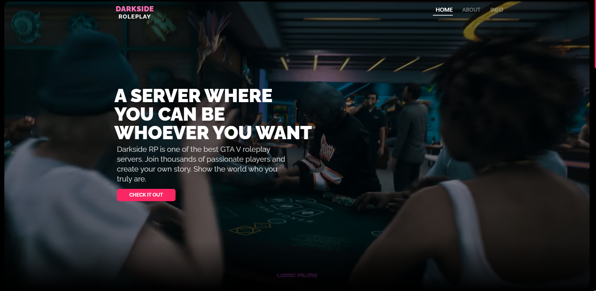

# 🕶️ DarkSide RP Server Website

DarkSide RP is a modern, responsive website built for a GTA V RolePlay server running on FiveM. Developed using React, Next.js, and Tailwind CSS, the site offers fans an immersive introduction to the unique roleplaying experience and vibrant community of DarkSide RP.

## 🚀 Features

- **Unique RP Experience** – Dive into a roleplaying world where you can create your own character and story on the FiveM server.
- **Active Player Community** – Join a tight-knit group of players who shape the world together.
- **Dynamic Map and Events** – Explore the ever-evolving city of Los Santos with new locations and exciting events.
- **Factions and Roles** – Become part of one of many factions, including law enforcement, and experience thrilling gameplay.
- **Responsive Design** – The website is fully optimized for desktop, tablet, and mobile devices.
- **Cutting-Edge Web Technologies** – Built with Next.js for fast loading and SEO optimization, React for interactive UI, and Tailwind CSS for sleek, modern styling.

    
    

## ℹ️ About

DarkSide RP is a place where you can be whoever you want — experience unique roleplay, create stories, and discover endless opportunities to interact within the world of Los Santos.

This site is a community-driven project focused on clarity, speed, and modern design.

## 📬 Contact

- **Email:** contact@darkside.pl  
- **Forum:** [forum-darkside.pl](http://forum-darkside.pl)  

&copy; 2025 AmazingDev.PL — an independent project not affiliated with Rockstar North or Take-Two Interactive.

